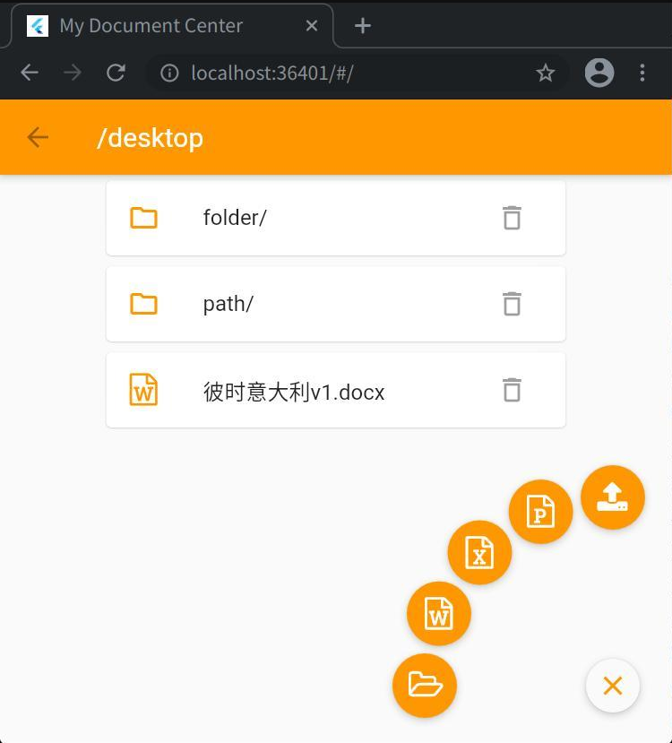
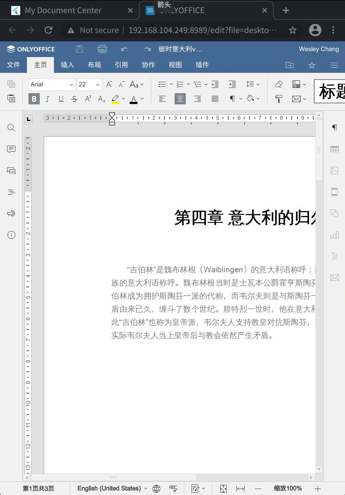

A cross platform flutter app for browsing, saving and editing online documents, including server, powered by onlyoffice.

Also a convenient tool to set up a personal cloud-document space.

# Server setup

## Docker preparation

Setup onlyoffice documentserver: `docker pull onlyoffice/documentserver` and `docker run -it -p 8990:80 onlyoffice/documentserver`. More details could be found at [documentserver](https://github.com/ONLYOFFICE/Docker-DocumentServer). Using `onlyoffice/documentserver:latest-arm64` if your machine is arm64 linux.

## Server running

Now that onlyoffice doucmentserver is ready, we start to run cloudoc. cloudoc is only a storage operation interface.

`dart bin/server.dart <ip>:8990`, the last parameter only tells cloudoc where is doucmentserver so that cloudoc could pass data to it. `ip` is what current machine's ip address, `localhost` could not make docker-doucmentserver work.

# Client running

## Install flutter sdk

Do as flutter [doc](https://docs.flutter.dev/get-started/install) said.

`flutter run -d chrome` would start a web page in browser, while other platform is available with `-d` options.
